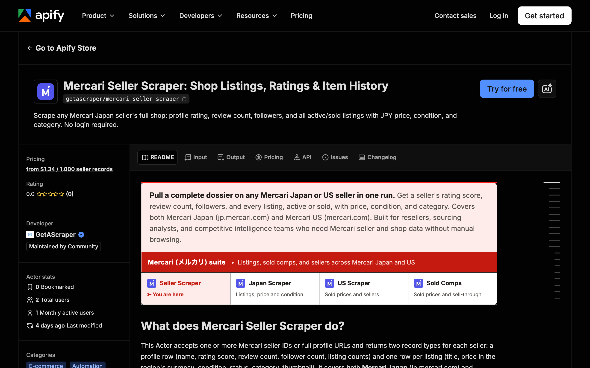

<div align="center">

# Mercari Seller Scraper: Shop Listings, Ratings and Reviews

[](https://apify.com/getascraper/mercari-seller-scraper)
[](https://apify.com/getascraper/mercari-seller-scraper)
[](https://apify.com/getascraper/mercari-seller-scraper)
[](https://github.com/getascraper/how-to-scrape-mercari-seller/issues)
[](https://github.com/getascraper/how-to-scrape-mercari-seller/commits/main)

Scrape any Mercari Japan seller's full shop: profile rating, review count, followers, and all active/sold listings with JPY price, condition, and category. No login required.

[](https://apify.com/getascraper/mercari-seller-scraper)

</div>

---

## Why use Mercari Seller Scraper

* **Full shop in one run**: get a seller's profile stats plus every listing, active and sold, without opening a browser.
* **Sourcing due diligence**: check a seller's rating score, review count, and sold history before placing a bulk order.
* **Competitor tracking**: schedule daily runs on a rival reseller's shop to catch new drops and price changes.
* **No account needed**: the actor reads publicly visible seller and listing pages, so no Mercari login or cookies are required.
* **Clean spreadsheet output**: every field is flat and ready for Excel, CSV, or Google Sheets.

---

## How to use Mercari Seller Scraper

1. Open the actor on Apify and click **Try for free**.
2. Paste one or more seller IDs or full seller profile URLs.
3. Set the max listings per seller and choose whether to include sold items.
4. Click **Start**: the actor collects the seller profile and every matching listing, then writes one record per seller.
5. **Download your results**: export as Excel, CSV, JSON, or HTML from the Output tab.

---

## Input

At least one of `sellerIds` or `sellerUrls` is required.

| Field | Type | Required | Description |
| --- | --- | :---: | --- |
| `sellerIds` | array of strings | Yes* | Seller IDs. Japan example: `629110147`, taken from the profile URL. |
| `sellerUrls` | array of URLs | Yes* | Full seller profile URLs, for example `https://jp.mercari.com/en/user/profile/629110147`. The seller ID is extracted automatically. |
| `maxListingsPerSeller` | integer | No | Maximum number of listings to collect per seller. Default is 500. |
| `includeSold` | boolean | No | When enabled (default), both active and sold listings are collected. Disable to return active listings only. |
| `region` | string | No | Marketplace region. `JAPAN` scrapes jp.mercari.com (default) and `US` scrapes mercari.com. |
| `proxyConfiguration` | object | No | Proxy settings. Apify Proxy is prefilled and recommended. |

`*` Provide at least one of `sellerIds` or `sellerUrls`.

---

## Output

Each row in your dataset is one seller, with that seller's listings nested inside the same record. All fields are flat within each object, so the file opens cleanly in any spreadsheet program.

```json
{
  "recordType": "seller",
  "sellerId": "629110147",
  "sellerName": "vintage_tokyo_store",
  "profileUrl": "https://jp.mercari.com/en/user/profile/629110147",
  "ratingScore": 4.8,
  "numRatings": 312,
  "numListings": 47,
  "numSold": 890,
  "followers": 128,
  "listings": [
    {
      "listingId": "m66939329940",
      "title": "Apple Watch Series 4 44mm",
      "price": 5000,
      "priceJpy": 5000,
      "currency": "JPY",
      "status": "on_sale",
      "conditionId": "3",
      "categoryId": "3676",
      "url": "https://jp.mercari.com/item/m66939329940",
      "thumbnailUrl": "https://static.mercdn.net/thumb/item/webp/m66939329940_1.jpg",
      "listedAt": "2026-06-15T08:22:11Z"
    },
    {
      "listingId": "m71204458812",
      "title": "Nintendo Switch OLED Console",
      "price": 24800,
      "priceJpy": 24800,
      "currency": "JPY",
      "status": "sold_out",
      "conditionId": "2",
      "categoryId": "1157",
      "url": "https://jp.mercari.com/item/m71204458812",
      "thumbnailUrl": "https://static.mercdn.net/thumb/item/webp/m71204458812_1.jpg",
      "listedAt": "2026-05-30T11:04:02Z"
    }
  ],
  "scrapedAt": "2026-07-01T10:00:00.000Z"
}
```

### Data table

| Field | Type | Description |
| --- | :---: | --- |
| `recordType` | string | Always `seller`, one record per scraped seller. |
| `sellerId` | string | Mercari seller account ID. |
| `sellerName` | string | Display name on the seller's profile page. |
| `profileUrl` | string | Full URL of the seller's profile. |
| `ratingScore` | number | Rating score shown on the profile, for example 4.8. |
| `numRatings` | number | Total reviews received. |
| `numListings` | number | Active listings currently in the shop. |
| `numSold` | number | Total items sold shown on the profile. |
| `followers` | number | Follower count. |
| `listings` | array | Every listing collected for this seller, active and sold, up to the requested limit. |
| `scrapedAt` | string | ISO timestamp when the record was collected. |

**Fields inside each `listings` entry**

| Field | Type | Description |
| --- | :---: | --- |
| `listingId` | string | Mercari item ID. |
| `title` | string | Item title. |
| `price` | number | Listing price in the seller's regional currency. |
| `priceJpy` | number | Listed price in Japanese Yen. |
| `currency` | string | `JPY` for Japan listings, `USD` for US listings. |
| `status` | string | `on_sale`, `sold_out`, or `trading`. |
| `conditionId` | string | Condition code, from new to poor. |
| `categoryId` | string | Mercari category identifier. |
| `url` | string | Full listing URL. |
| `thumbnailUrl` | string | Primary thumbnail image URL. |
| `listedAt` | string | ISO timestamp when the item was first listed. |

---

## Pricing

**$1.79 per 1,000 seller records.** You are charged $0.00179 for each seller record the actor returns, and every listing that seller has is bundled into that same record at no extra charge. There are no monthly subscriptions and no minimum spend. New Apify accounts include $5 of free usage, so you can try it before you pay.

You only pay for the sellers you collect. A typical run of 10 sellers completes in a few minutes depending on shop size.

---

## Quick start

Create a `.env` file from `.env.example`, add your [Apify API token](https://console.apify.com/account/integrations), and run:

```bash
npm install
npm start
```

The script uses the [Apify API client](https://docs.apify.com/api/client/js/) to start [Mercari Seller Scraper](https://apify.com/getascraper/mercari-seller-scraper) and fetch results.

---

## Tips and optimization

* **Find a seller ID**: open any seller's profile on jp.mercari.com. The ID is the last part of the URL, for example `629110147` in `https://jp.mercari.com/en/user/profile/629110147`.
* **Active listings only**: set `includeSold` to false to skip sold items and shorten run time.
* **Monitor new listings**: schedule this actor to run daily on the same seller IDs, then compare datasets to see what was added or sold.
* **Multiple sellers at once**: add all IDs to `sellerIds` in one run. Listings are deduplicated automatically across sellers.

---

## FAQ

**How do I find a seller ID?**
Open the seller's profile page on jp.mercari.com. The ID is the last part of the URL, for example `629110147` in `https://jp.mercari.com/en/user/profile/629110147`.

**Do I need a Mercari account or login?**
No. The actor reads only publicly visible seller and listing data. No login or cookies are required.

**Why are some profile fields missing?**
Seller profile fields are read from the public profile page. When a seller has no ratings or followers, those fields are left out rather than guessed.

**Is it legal to scrape Mercari data?**
This actor collects publicly visible data from Mercari for research and analysis. You are responsible for following Mercari's terms of service and any applicable data protection laws. Do not use collected data to contact individuals or for prohibited purposes.

---

## Support

For bug reports, missing fields, or feature requests, open an issue under the [Issues](https://github.com/getascraper/how-to-scrape-mercari-seller/issues) tab.
